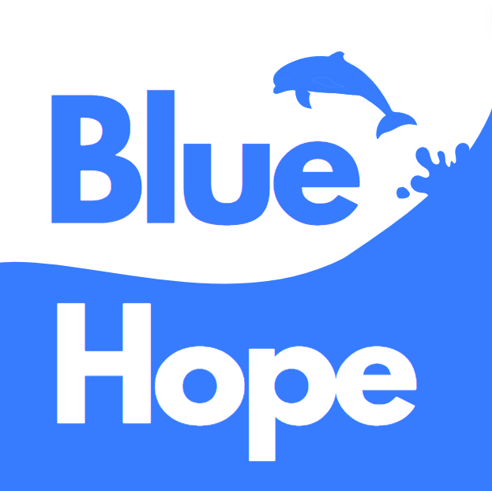

- [Descrição do Projeto](#descrição-do-projeto)
- [Documentação da API](#documentação-da-api)
- [Frontend](https://github.com/Santlago/FE-BlueHope)
- [Backend](https://github.com/Santlago/BE-BlueHope)

# Descrição do Projeto

O BlueHope é uma plataforma inovadora dedicada a assegurar que as atividades humanas nos oceanos sejam ecologicamente sustentáveis, socialmente inclusivas e economicamente viáveis a longo prazo. Utilizando um sistema de desafios, incentivamos os usuários a realizar ações ambientais, recompensando-os com pontos que podem ser trocados por certificados e premiações. Nossa inteligência artificial valida a conclusão dos desafios, garantindo a autenticidade das ações realizadas. Nosso objetivo é melhorar a saúde dos oceanos e da vida marinha, promovendo práticas positivas e sustentáveis.

## Funcionalidades Principais

- **Sistema de Desafios**: Proposta de desafios ecológicos para os usuários completarem, como limpar praias e lagos.
- **Ganho de Pontos e Recompensas**: Pontuação por desafio completado, com acesso a certificados e premiações para incentivar mais ações.
- **Validação por IA**: Uso de inteligência artificial para validar a conclusão dos desafios e garantir a veracidade das ações.
- **Monitoramento de Impacto**: Acompanhamento do impacto ambiental das ações realizadas pelos usuários.
- **Relatórios Detalhados**: Geração de relatórios sobre as atividades e o impacto positivo gerado, com sugestões para novas ações.
- **Comunidade e Colaboração**: Espaço para que usuários compartilhem suas experiências e se apoiem mutuamente em novos desafios.

## Como Funciona

1. **Cadastro do Usuário**: O usuário se cadastra na plataforma BlueHope, fornecendo as informações necessárias.
2. **Escolha de Desafios**: O usuário escolhe entre os diversos desafios disponíveis que visam melhorar a saúde dos oceanos.
3. **Execução do Desafio**: O usuário realiza o desafio escolhido, documentando suas ações conforme orientações.
4. **Validação do Desafio**: Nossa IA analisa a documentação fornecida e valida a conclusão do desafio.
5. **Ganho de Pontos e Recompensas**: Com o desafio validado, o usuário acumula pontos que podem ser trocados por certificados e premiações.
6. **Monitoramento e Feedback**: A plataforma acompanha o impacto das ações e fornece feedback contínuo para otimização dos esforços.

## Benefícios

- Promoção de atividades ecologicamente responsáveis e sustentáveis.
- Incentivo à participação através de recompensas e certificados.
- Validação rigorosa das ações para garantir a autenticidade.
- Melhoria contínua da saúde dos oceanos e da vida marinha.
- Fortalecimento de uma comunidade comprometida com a sustentabilidade.

## Tecnologias Utilizadas

- Linguagens de Programação: [Java, Python, JavaScript, TypeScript e C#]
- Frameworks: [Next.js, Java SpringBoot e Tailwind CSS]
- Plataformas de Desenvolvimento: [GitHub, AzureDevOps, Figma e Trello]

## Equipe

- [Breno Lems Santiago] - RM: 552270
- [Felipe Guedes Gonçalves] - RM: 550906
- [Luiz Fellipe Soares de Sousa Lucena] - RM: 551365
- [Nina Rebello Francisco] - RM: 99509
- [Vitória Maria de Camargo] - RM: 552344

## Como Contribuir

Caso tenha interesse em contribuir com o desenvolvimento do BlueHope, sinta-se à vontade para abrir pull requests, reportar problemas ou sugerir melhorias em nosso repositório no GitHub.
